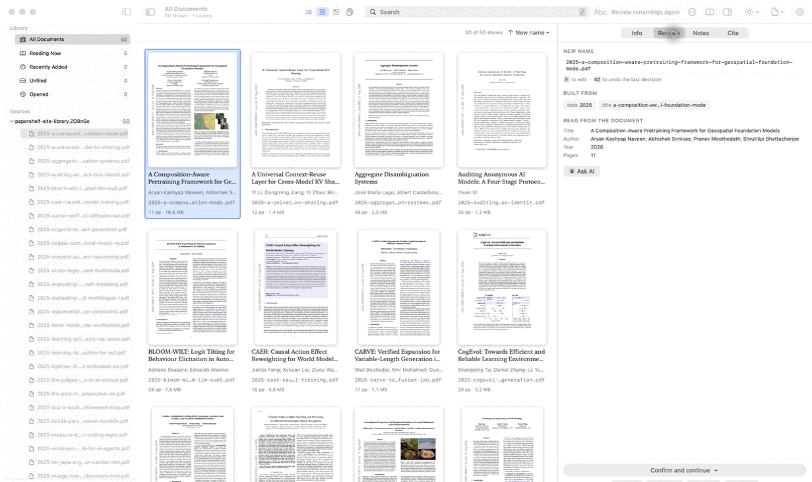

# PaperShelf

The macOS PDF reader and library manager for people who search, highlight, cite, and file
research papers. It is the reader I wished I had years ago.

> PaperShelf is under heavy development. It is functional, but releases can change stored
> preferences and behavior.



## Install

```sh
brew tap jonaprieto/papershelf
brew install --cask papershelf
```

The cask installs the latest release. Builds are ad-hoc signed while notarization is on the
roadmap, so the first launch may require right-click, Open in Finder. To build locally:

```sh
./build.sh --install
```

PaperShelf has no third-party Swift package dependencies. It runs on macOS 14 or later.

## What it does

- Reads PDFs in a focused reader with full screen, page navigation, contrast modes, and
  notes that stay beside the passage they describe.
- Searches filenames, metadata, extracted text, folders, tags, pages, and projects.
- Highlights passages with customizable meanings per library, folder, project, or paper.
- Writes a generated Markdown companion beside a PDF, with PDF annotations as the source of
  truth.
- Reviews safe filename changes before applying them, keeps originals when requested, and
  finds duplicate documents without guessing that similar names are identical.
- Builds BibTeX and connects a local MCP server to ChatGPT without uploading the library.

## Roadmap

- [ ] Notarized and signed releases
- [ ] Stable 2.0 storage and plugin interfaces
- [ ] Better OCR and reading-project workflows
- [ ] Upstream Homebrew Cask submission when the project meets its requirements

## Links

- [Landing page](https://jonaprieto.github.io/papershelf/)
- [Latest release](https://github.com/jonaprieto/papershelf/releases/latest)
- [Build and test contract](HACKING.md)
- [Contributing](CONTRIBUTORS.md)
- [Changelog](CHANGELOG.md)
